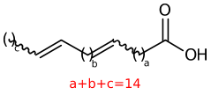
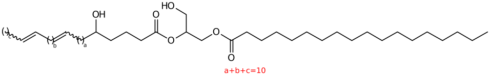

# Stage 3 with EAD: within-chain localization

Stage 3 begins only after stages 1 and 2 have produced an eligible lipid assignment. It does **not** repair a missing or weak stage-2 identification. Its role is to evaluate within-chain C=C positions and, with EAD2, supported oxygen-site hypotheses.



## What stage 3 reports

- **ID level 3:** individual positional isomer candidates that remain credible for a feature.
- **ID level 4:** an aggregate, evidence-aware consensus across retained level-3 candidates.

For a lipid initially identified as `PC 16:0_18:1`, level 3 may contain multiple candidates such as `PC 16:0_18:1(9)` and `PC 16:0_18:1(11)`. Level 4 names a position only when the configured assertion rule is met; otherwise it preserves the unlocalized chain and reports the evidence distribution in the confidence tail.

## Select an EAD engine

```yaml
WORKFLOW:
  stage3: ead1       # or ead2
```

| Engine | Use when | Scope |
| --- | --- | --- |
| `ead1` | The data are EAD-style chain-cleavage spectra and lipids are unoxidized. | Heuristic chain ladder for C=C position candidates. Oxidized species are skipped. |
| `ead2` | The data are EAD-style chain-cleavage spectra and oxygenated lipids may be present. | Exact-formula cleavage model for C=C, hydroxyl, and ketone hypotheses. |

Use `ead2` for supported oxidized lipids. Do not use either EAD engine for an OAD, OzID, or UVPD acquisition merely to obtain a positional result. Those methods have their own engine selection in `WORKFLOW.stage3`.

## Shared EAD workflow

1. Select stage-2 parents at ID level 2 or above. When `s3_include_ms1_monochain: true`, unsaturated single-acyl level-1 parents such as LPC/LPE can enter after MS1, cleanup, and RT filtering.
2. Parse chain tokens such as `16:0_18:1` or `20:4;O`.
3. Enumerate chemically valid within-chain position hypotheses, including combinations across chains.
4. Predict chain-relative diagnostic fragment losses and match them to observed peaks within `ms2_tolerance`.
5. Score candidates using the selected engine, then select a credible set.
6. Write level-3 candidates and aggregate supported structural aspects into level 4.

Saturated chains deliberately contribute no EAD localization ladder: they have no C=C position to determine. Their chain identity belongs to stage 2, not stage 3.

## Candidate-space controls

```yaml
PARAM:
  s3_include_ms1_monochain: true
  s3_max_unsaturated: 6
  s3_max_oxygen: 2
  s3_max_candidates: 100000
  s3_intensity_scaling: 'none'
```

A `20:4` chain has 1,365 non-adjacent C=C arrangements. A `20:4;O` chain can generate roughly 22,300 valid hydroxyl/ketone hypotheses. If `s3_max_candidates` is smaller than the candidate space, the implementation stride-samples hypotheses before scoring. That can remove the true structure before evidence is evaluated. Treat this as a search-coverage limit, not a low score.

` s3_max_oxygen` is honored by EAD2 and UVPD. EAD1 has no oxygen model. `s3_intensity_scaling` can be `none`, `sqrt` or `light`, `log10`, `ln`, or `log2`; it applies to intensity-weighted engines. Keep the setting fixed when comparing runs.

## EAD1 scoring and assertion

EAD1 uses an empirical CH/CH2/CH3 loss ladder, includes `0`, `-H`, and `+H` variants, and matches predicted and observed peaks one-to-one. Its score is intensity aware: matched-fragment weights are combined with transformed intensity and normalized with a log/MAD-type treatment.

EAD1 requires both of these before placing positions in the level-4 name:

```yaml
PARAM:
  s3_min_margin: 0.05
  s3_min_matched: 3
```

- `s3_min_margin` is the minimum relative gap between the best and second-best raw candidate scores: `(s1 - s2) / s1`.
- `s3_min_matched` is the minimum matched diagnostic-fragment count for the winning candidate.

These gates distinguish a decisive winner from a nominally top candidate supported by only one or two peaks. EAD1's resolvability field is diagnostic and does not gate default output.

## EAD2 scoring and oxygen branches

EAD2 derives fragment mass from the elemental difference between intact and cleaved chain fragments, so headgroup and charge-carrier mass cancel. It enumerates non-adjacent C=C positions and hydroxyl/ketone placements on remaining compatible sp3 carbons. Its bond weights distinguish positions alpha to a functional carbon, one bond from an allylic carbon, and default cleavages.

Predicted fragments are matched independently. One observed peak can support multiple predicted fragments, unlike the EAD1 one-to-one matching rule. The raw score is the weighted sum of matched transformed intensities. EAD2 does not apply EAD1's precursor-minus-5-Da diagnostic trim.

For oxygenated hypotheses, `s3_oxo_rarity_prior` multiplies a candidate score for each asserted ketone. The default `0.85` requires stronger raw fragment support for an oxo branch to defeat an isobaric hydroxyl branch. It is a fitted prior, not direct chemical identification.



## Candidate selection and `score_s3`

The recommended path is posterior selection:

```yaml
PARAM:
  s3_selection: posterior
  s3_post_temperature_ead1: 0.03
  s3_post_temperature_ead2: 0.003
  s3_post_credible_level: 0.95
  s3_post_odds_floor: 0.125
  s3_post_min_mass: 0.5
  s3_output_max: 100
  s3_output_extra: 2
```

For a closed candidate set, the posterior is calculated from normalized raw scores:

```text
p_i = softmax(((raw_i - raw_max) / abs(raw_max)) / temperature)
```

- The smallest score-ranked set reaching `s3_post_credible_level` is retained.
- `s3_post_odds_floor` removes a candidate once its posterior drops below the configured fraction of the top candidate.
- A position appears in the level-4 name only if its marginal posterior mass reaches `s3_post_min_mass`.
- `s3_output_max` caps written level-3 rows but not the evidence set used for level-4 aggregation. `s3_output_extra` adds a few non-kept rows for context.

With `posterior`, `score_s3` is candidate posterior probability over the complete generated candidate set. Exported rows need not sum to 1 because low-probability unreported candidates remain absent. `score_s3_raw` retains the underlying unnormalized score.

`legacy` selection retains candidates within `s3_legacy_cutoff` of the top score. In that mode `score_s3` is a rescaled or raw score, not a probability. Use it only when reproducing a legacy protocol.

## Resolvability and confidence language

Stage-3 `rival_resolvability` asks whether a candidate is separated from its best disagreeing rival by observed **exclusive** fragments. It is neither a posterior probability nor a universal gate. EAD2 exposes `s3_ead2_gate_db_on_resolvability`, but it is experimental and off by default because its recall cost is large.

The interpretation is deliberately conservative:

- A credible level-3 candidate is a hypothesis supported well enough to report.
- A level-4 positional name is an aggregate assertion that passed the engine's naming rule.
- A level-4 result without a localized position is not a failure. It is the correct outcome when the spectrum does not separate valid isomers.

Inspect `diag/annotation_stage3.csv`, `diag/annotation_stage4.csv`, `diag/s3_resolvability.csv`, `score_s3_raw`, `score_s3`, `s3_kept`, and the dashboard spectrum view before interpreting biology from a localization call.

For oxidation-specific chemistry, constraints, and cautions, read [Oxidation analysis](oxidation.md).
